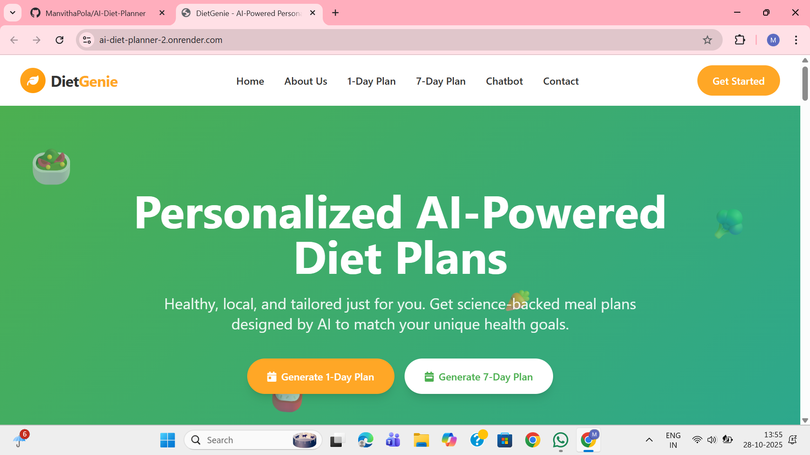
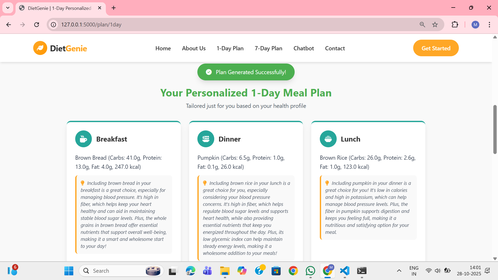
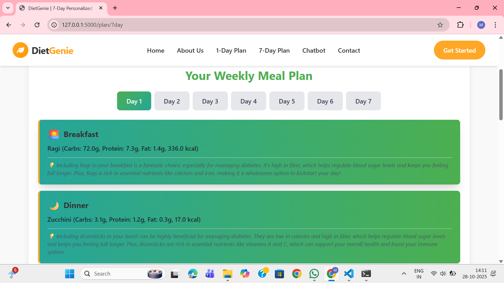

# 🌿 DietGenie – AI-Powered Personalized Diet Planner

DietGenie is a web-based platform that generates **personalized, healthy, and culturally relevant diet plans** using **Generative AI**. It considers a user’s **age, gender, and health conditions**, and provides **1-Day and 7-Day meal plans** that include nutritional breakdown and explanation for each meal.  
It also includes a **smart diet chatbot** that allows users to ask questions or request meal substitutions in real time.

---

## 🧠 Why DietGenie?

Many people want to eat healthier, but face common challenges:

- Visiting a nutritionist is **expensive and time-consuming**
- Most online diet charts are **generic and not disease-specific**
- People require **diet plans that match their health conditions**
- Diet suggestions often include **foods that are not locally available**
- Manually planning meals and calculating nutrients can be **confusing**

DietGenie solves these problems by personalizing diet plans using **AI + verified nutrition datasets**, ensuring that the recommendations are **practical, healthy, and culturally familiar**.

---

## 📌 Problem Statement

People with lifestyle and chronic health conditions such as **Diabetes, PCOS, Hypertension, Thyroid disorders, or Obesity** require **carefully planned diets**.  
However, consulting nutritionists regularly is **not always feasible**, and generic online diet charts are **not reliable**.

There is a need for an **automated and personalized diet planning system** that:
- Understands user health conditions
- Uses safe and verified nutrition data
- Suggests commonly available food items
- Provides explanation and reasoning for each meal

---

## 📝 Abstract

DietGenie is an AI-powered diet planning system that generates personalized meal plans based on user attributes such as **age, gender, and health conditions**. The platform uses a **nutritionist-verified dataset** to ensure dietary accuracy and safety. Generative AI is used to produce meal explanations and chatbot responses. The system outputs **1-Day and 7-Day meal plans**, ensuring **diet variety, balanced macronutrients, and accessible food choices**. DietGenie reduces dependency on nutritionist consultations and provides a convenient, reliable, and easy-to-use solution for promoting healthier lifestyles.

**Keywords:** Generative AI, Personalized Diet Plan, Nutrition Dataset, Healthcare Automation, Meal Recommendation System.

---

## ⭐ Key Features

| Feature | Description |
|--------|-------------|
| **1-Day Personalized Plan** | Generates one-day diet plan with food items and nutritional values |
| **7-Day Weekly Diet Plan** | Ensures variety and avoids repetition of meals across the week |
| **AI Explanation for Meals** | Each meal includes a friendly explanation tailored to the user’s health condition |
| **Interactive Diet Chatbot** | Allows users to ask questions or request alternative meals |
| **Health Condition Support** | Supports multiple conditions such as Diabetes, BP, PCOS, Thyroid, Obesity, etc. |
| **JSON Storage** | Plans are saved to JSON for future use, tracking, and non-repetition |

---

## 🧭 System Approach

### 1️⃣ User Input
- Age
- Gender
- Health Conditions (multiple allowed)

### 2️⃣ Dataset Filtering
- Filters foods that match both meal category & health suitability

### 3️⃣ AI-Generated Explanation
- Uses OpenAI to explain why each meal suits the user

### 4️⃣ Nutritional Summary Computation
- Calculates daily calories and macronutrient values

### 5️⃣ Result Display
- Clean UI with categorized meal cards and total calorie summary

### 6️⃣ Optional Chatbot Guidance
- Helps users modify or ask diet questions interactively

---

## 🏗️ Tech Stack Used

| Layer | Technology |
|------|------------|
| **Frontend** | HTML, TailwindCSS, JavaScript |
| **Backend** | Python (Flask) |
| **AI Integration** | OpenAI API (gpt-4o-mini) |
| **Dataset** | Nutritionist-verified diet CSV dataset |
| **Storage** | JSON (previous plans storage) |
| **Deployment** | Platform hosting (example: Render) |
| **Version Control** | Git & GitHub |

---

## 🎯 How to Run Locally

```bash
# Clone the repository
git clone https://github.com/your-username/DietGenie.git

# Navigate to backend folder
cd DietGenie/backend

# Create Virtual Environment
python -m venv venv
venv\Scripts\activate   # (Windows)

# Install dependencies
pip install -r requirements.txt

# Add your OpenAI API Key in .env
OPENAI_API_KEY=your_key_here

# Run Flask app
python app.py

### ✅ Run the Application
Once the backend server starts successfully, open your browser and visit:
http://localhost:5000
```

---

### 🖼️ Screenshots

| Page | Preview |
|------|---------|
| **Home Page** |  |
| **1-Day Plan Page** |  |
| **7-Day Plan Page** |  |
| **Diet Chatbot Page** |  |

---

### 🚀 Future Enhancements

- Integration with **wearable devices** (smartwatches, fitness bands) for real-time health monitoring.
- **Multilingual UI support** to improve accessibility across different regions.
- Addition of **regional and seasonal food recommendations**.
- **Meal tracking** feature for behavior-based personalization.
- **Dietitian collaboration tools** for expert review and customization of diet plans.

---

### 💡 Why DietGenie Stands Out

| Feature | Benefit |
|--------|---------|
| **Personalized Meal Plans** | Tailored to age, gender & health conditions |
| **Nutritionist-Verified Data** | Ensures safety & professional reliability |
| **User-Friendly & Practical** | Uses locally available foods |
| **AI-Powered Assistance** | Smart chatbot for guidance and meal substitutions |
| **Promotes Long-Term Healthy Habits** | Encourages sustainable lifestyle improvements |

---

🌱 **Eat Smart. Live Better.**  
*Developed with purpose, care, and AI.*

